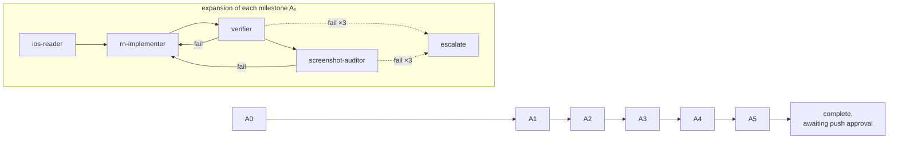

# Android React Native App (bare RN CLI) — Goal & Execution Plan

> **Status:** 🟢 A1 verifying (pivoted off Expo) — branch `android-native`. **A0 ✅ COMPLETE.** A1 app code complete + `tsc`/Jest **5/5** green. **Decision revision (requester-approved):** `expo-modules-core` proved non-viable in this bare-RN-0.83 bridgeless monorepo (6 sequential integration walls, ending in an opaque bridgeless-runtime crash), so A1 **pivoted off Expo** back to the proven A0 baseline: **`@react-native/async-storage`** for the refresh token (New-Arch, maintained; encrypted storage deferred), **device-location deferred** (register wizard's manual-city path covers A1), and **JS-only navigation** (react-native-screens/React Navigation deferred — its codegen also conflicts with this env's RN 0.83). Backend on port **8001** (`/api/v1`); dev DB was recreated from empty (requester-approved) — the "stale-base" RI migrations apply clean from scratch. **A1 ✅ COMPLETE.** `verifier` ✅: `tsc` + Jest **5/5** (incl. 401-refresh) + **Maestro auth E2E green** (register → login → onboarding gate → home → sign out → re-login, against the live backend). `screenshot-auditor` ✅: Login + register wizard render faithfully in light + dark. Graph: **A1 all four nodes passed.**
>
> **A2 ✅ COMPLETE** (Wardrobe) — tab shell (floating pill TabBar, JS tab state) + wardrobe grid (camera/library upload via `react-native-image-picker`, category chips, status-polling two-column grid, pull-to-refresh), item detail with **archive/unarchive**, archived view. `verifier` ✅: `tsc` + Jest **7/7** + **Maestro wardrobe E2E green** (seeded item → grid → detail → archive → archived view) + auth-flow regression green. `screenshot-auditor` ✅: wardrobe renders faithfully, seeded images load from backend, light+dark. Classification in documented degraded mode (no GROQ key).
>
> **A3 ✅ COMPLETE** (Onboarding & Style DNA) — full onboarding flow (upload → results → review → batch capture → opt-in selfie → complete), Style DNA card + profile in the Profile tab. Built by an orchestrated sub-agent; orchestrator verified on-device. `verifier` ✅: `tsc` + Jest **10/10** + **onboarding Maestro E2E green (31 steps)** (register → onboarding via Skip path → tabs → Style DNA row). Style DNA extraction in degraded mode (no GROQ key). Graph: **advance to A4 (Today, recommendations & outfits).**
> **Audience:** Any LLM or developer executing a milestone. Read this file + the single milestone file you are executing. Milestone files (`01-…` onward) are written when a milestone starts and must be self-contained.
> **Relationship to other docs:** This is a separate delivery track, modeled on `docs/06-ios-native/` (the native iOS track). It targets the **Android** client. It does **not** modify the backend (`apps/api/`) or the native iOS app (`apps/ios/`); it *replaces* the current Expo scaffold inside `apps/mobile/`.

---

## Goal

Rebuild the ATTREQ mobile client as a **bare React Native CLI app, Android-first**, that replicates the **native iOS app (`apps/ios/`) as it exists on the current branch** — the Redesign v2 visual language *plus* all Recommendation-Intelligence (RI-era) additions — 1:1 in design and functionality, against the same FastAPI backend.

**Done means:** on an Android device/emulator, a user can complete every flow the current iOS app supports — register (3-step wizard), login, opt-in personal-color selfie onboarding, Style DNA onboarding (upload → results → review), batch wardrobe capture, browse/upload/detail/archive wardrobe items, get daily weather-aware recommendations with explanations, give feedback (wear/skip/love/dismiss + rejection reasons), use the swipe deck, view history, view wardrobe stats, read "how recommendations work," and manage their profile — and **every screen matches the iOS app in both light and dark themes**, verified running on an Android emulator.

---

## Execution Graph

This track executes as an explicit graph, not a flat checklist. The milestone table below is the fast-reference view of the same graph and must stay cross-consistent with this section.



### State source (single)

The graph's current position is always read from **this file's Status line (top)** and the **Milestones table** below — **not held in any node's own memory**. A node re-reads both on entry to learn where it is; on completion it updates the Status line / table. There is no second state file.

### Nodes

Each milestone `A0`–`A5` is the same four-node subgraph run in order. Read/write scopes are stated explicitly so a hook can enforce them later.

| Node | Does | Reads (read-only) | Writes |
|---|---|---|---|
| **ios-reader** | Extract this milestone's spec from the references; resolve source-of-truth conflicts per the edge-routing rules. | `apps/ios/`, `assets/design/ios-redesign-v2/*.jsx`, `apps/api/src/attreq_api/schemas/` | *nothing in the repo* — notes to scratchpad only |
| **rn-implementer** | Build this milestone's screens/logic to match the ios-reader spec. | `apps/mobile/`, ios-reader notes | **only `apps/mobile/`** |
| **verifier** | `tsc --noEmit` + Jest + **Maestro E2E on the emulator** (the milestone's functional flows against the local backend). The single automated hard pass/fail node — no judgement. | `apps/mobile/`, the built app, local API | Maestro logs/artifacts → scratchpad only (*nothing in the repo*) |
| **screenshot-auditor** | Boot the emulator in light + dark, screenshot each screen, compare against the iOS reference + handoff specs. | built `apps/mobile/` app, `apps/ios/`, `assets/design/ios-redesign-v2/` | screenshots → scratchpad only |

### Edges

- **Sequential milestone dependency** (previously only implied by table order): `A0 → A1 → A2 → A3 → A4 → A5`. A milestone's `ios-reader` may not start until the previous milestone has reached its terminal gate. Intra-milestone order is fixed: `ios-reader → rn-implementer → verifier → screenshot-auditor`.
- **Conflict-routing rules** (the doc's two "Conflict rule" facts, expressed as routing the `ios-reader` performs when building the spec — the prose statement in "Three (four) sources of truth" remains the canonical wording):
  - iOS flow **vs** old `apps/mobile/` RN flow → route to **iOS** (newer, canonical design wins).
  - iOS contract **vs** backend contract → route to **backend** (`apps/api` schemas win).
  - Static mock content in the design (names, "24 pieces", "87% match") is never a source — bind real data.

### Cycles (per node, on failure — no full-milestone or `ios-reader` restart)

- **A0** — verifier fail → **A0.rn-implementer**; screenshot-auditor fail → **A0.rn-implementer**.
- **A1** — verifier fail → **A1.rn-implementer**; screenshot-auditor fail → **A1.rn-implementer**.
- **A2** — verifier fail → **A2.rn-implementer**; screenshot-auditor fail → **A2.rn-implementer**.
- **A3** — verifier fail → **A3.rn-implementer**; screenshot-auditor fail → **A3.rn-implementer**.
- **A4** — verifier fail → **A4.rn-implementer**; screenshot-auditor fail → **A4.rn-implementer**.
- **A5** — verifier fail → **A5.rn-implementer**; screenshot-auditor fail → **A5.rn-implementer**.

### Gates (the literal pass condition per milestone — identical text to the Milestones table's "Exit criteria (gate)" column)

- **A0:** Component gallery screen renders every design-system piece in both themes on an Android emulator; `tsc --noEmit` + Jest green; app boots.
- **A1:** Register → login → logout work against local API; 401-refresh unit-tested; Maestro auth flow green; screens match iOS in both themes.
- **A2:** Upload a photo → classified + displayed; open detail; archive/unarchive — matching iOS.
- **A3:** Fresh account completes full onboarding (incl. selfie opt-in + batch capture) → lands on tabs; Style DNA card renders.
- **A4:** Daily suggestions render with weather + explanation; wear/skip/reject flows work; swipe deck feeds feedback; worn outfits appear in History.
- **A5:** Side-by-side emulator screenshots match iOS for every screen in both themes; full test suite + Maestro flow green.

Within each gate: the automated portion — `tsc --noEmit`, Jest, and **Maestro E2E functional flows** (e.g. "Register → login → logout work against local API", "wear/skip/reject flows work") — is checked by **verifier**; the visual / both-theme portion by **screenshot-auditor**.

### Terminal states

- **complete, awaiting push approval** — reached only when all six milestones' gates have passed. The graph **never auto-pushes** (per Ground rules and "Milestone-completion / push discipline"): it halts here and waits for explicit requester approval to push `android-native`.
- **escalate** — any single node that fails its gate **3 times in a row** halts the graph and escalates to the requester; it must not silently advance or keep looping.

---

## Decisions (locked — from the requester, 2026-07-23)

| Question | Decision |
|---|---|
| Relationship to existing app | **Rebuild `apps/mobile/` in place** — replace the Expo scaffold; keep the path. |
| Toolchain | **Bare React Native CLI** (no Expo Router / no managed workflow / no CNG). |
| Native modules | **Bare CLI + `expo-modules-core`** — consume maintained Expo native modules (`expo-image`, `expo-linear-gradient`, `expo-secure-store`, `expo-location`, `expo-notifications`, `expo-haptics`) from within the bare app, *without* adopting Expo Router or the managed workflow. Chosen because the RN 0.83 target is bridgeless (New-Architecture-only) and several bare-community modules are archived/unmaintained (see "2026 ecosystem note"). |
| Platform scope | **Android-first; iOS ignored** — cross-platform RN codebase, but only Android is built/tested/verified. The iOS RN build is a non-goal (do not verify it). |
| Styling | **StyleSheet + a `Theme` token namespace** mirroring the iOS `DesignSystem` (`bg`, `surface`, `deep`, `text`, `t2`, `t3`, `accent`, `clay`, `moss`, tints, borders, garment gradients). No NativeWind. |
| Non-UI logic | **Port & reuse** the existing TS logic (Axios client, TanStack Query hooks, Zustand store, utils); replace only the UI layer + native modules. **Exception: `types.ts` is regenerated, not ported** — it predates RI (see scope note). |
| iOS baseline to match | **Current-branch iOS incl. RI-era additions** (not just M0–M5). |
| Branch | **New branch off `feat/recommendation-intelligence`** (so it includes the latest RI backend + the iOS RI features being replicated). Suggested name: `android-native`. |
| Theming | **Both light + dark**, system-appearance driven, full parity with iOS. |

### 2026 ecosystem note (why these choices, chosen with eyes open)

As of 2026 the React Native ecosystem has moved decisively toward **Expo as the default framework** for new apps — React Native's own "Getting Started" steers to a framework, and Continuous Native Generation (CNG) removed the old "managed = no native control" trade-off (giving prebuild + EAS builds + OTA + far smoother upgrades). **Bare RN CLI is now the ~5% minority path.** The requester deliberately chose bare CLI for native control / single-platform focus; that is valid, but it carries real costs that future maintainers should know were accepted knowingly:

- The `android/` project is hand-maintained (no CNG/EAS); RN version upgrades use the `react-native upgrade` path, not `expo install`; no OTA updates.
- **RN 0.83 is bridgeless (New-Architecture-only)** — there is no legacy-interop escape hatch, so every native dependency must be genuinely New-Arch-native. This is why the plan uses `expo-modules-core` to pull in maintained Expo modules instead of several archived/unmaintained bare-community equivalents (`@notifee/react-native` archived Apr 2026; `react-native-fast-image` unmaintained since ~2021; `react-native-geolocation-service` effectively unmaintained; `react-native-linear-gradient` thin on New-Arch).

Modern styling alternative considered and declined for the record: `react-native-unistyles` v3. StyleSheet + a `Theme` token namespace was chosen to stay closest to the iOS `DesignSystem` mental model (the locked decision).

---

## Three (four) sources of truth

| Concern | Source of truth |
|---|---|
| **Behavior, flows & visual reference** | Native iOS app `apps/ios/` on the current branch — the reference implementation. It is the most complete, Redesign-v2-faithful client and already carries the RI-era screens. When in doubt about *what a screen does or how it looks*, read the corresponding SwiftUI view. |
| **Design tokens & pixel specs** | `assets/design/ios-redesign-v2/*.jsx` (the original handoff — exact colors, type, spacing, radii). For RI-era screens **not** in the handoff, the iOS `DesignSystem` composition is the spec. |
| **Business logic to port** | `apps/mobile/src/` current TS (API client, query hooks, store, types, utils) — port and reuse, updating types to the current backend / iOS models. |
| **API contracts** | FastAPI backend `apps/api/src/attreq_api/` — wins over everything when they disagree. |

**Conflict rule:** where iOS and the old RN app disagree on flow, **iOS wins** (it is the newer, canonical design). Where iOS and the backend disagree on a contract, **the backend wins**. Static mock content in the design (names, "24 pieces", "87% match") is placeholder — bind real data.

---

## Ground rules

- **All app code lives in `apps/mobile/`.** The Expo scaffold there is replaced by the bare RN scaffold. Preserve the existing Android `applicationId`/package name if one is already configured; otherwise use `com.attreq.mobile`.
- **No backend changes.** Every flow maps onto existing endpoints; divergences are noted in the milestone file, not "fixed" server-side.
- **`apps/ios/` and `apps/api/` are read-only references.** Do not touch them. Their CI (`ios-ci.yml`, `backend-ci.yml`) must stay green (it will, since we don't edit them).
- **Match iOS, don't reinterpret.** Read the SwiftUI views and the handoff jsx directly; don't design from screenshots.
- **Android-first means Android-verified.** Every milestone ends runnable on an Android emulator in **both** light and dark. Do not spend effort validating the iOS RN build.
- **Verify library APIs with `ctx7`** at scaffold/implementation time (bare RN + community modules move fast) — do not pin versions from memory in this doc; resolve them live when scaffolding.

---

## Design tokens (mirror `apps/ios/DesignSystem/Theme/Theme.swift` ← `attreq-shared.jsx`)

Implement as a TS `Theme` object with `light`/`dark` variants, selected by `useColorScheme()` and exposed via a `ThemeProvider`/context so the OS appearance switch drives theming.

| Token | Light | Dark |
|---|---|---|
| `bg` | `#F5F2EE` | `#181512` |
| `surface` | `#FFFFFF` | `#231F1B` |
| `deep` / `text` | `#1C1917` | `#EDE9E3` |
| `t2` (secondary) | `#78716C` | `#9A9088` |
| `t3` (tertiary) | `#A8A29E` | `#6E6862` |
| `accent` (camel) | `#9B7B5A` | `#BA9272` |
| `clay` (destructive/skip) | `#BF5C45` | `#D4705A` |
| `moss` (positive/worn) | `#5A8A6A` | `#72AA86` |
| `border` / `borderSoft` | `rgba(28,25,23,0.08 / 0.05)` | `rgba(237,233,227,0.08 / 0.05)` |

Plus `accentSoft` / `claySoft` / `mossSoft` tinted backgrounds and the 5 garment-placeholder gradients per theme (`garmentGrads`). Spacing/radius/shadow scales already exist in `apps/mobile/src/theme/tokens.ts` — reuse them.

**Typography:** bundle **Cormorant Garamond** (display serif), **DM Sans** (body/UI), **IBM Plex Mono** (uppercase micro-labels, ~1.6px tracking) as `.ttf` assets linked via `react-native.config.js`. All OFL Google Fonts — do not substitute system fonts. Expose helpers (`display`, `body`, `mono`) mirroring the iOS `Typography`.

**Signature components** (build once in a `design-system/` folder, reuse everywhere): floating pill tab bar (TODAY / WARDROBE / HISTORY / PROFILE, blur/translucent background, bottom-inset), 20-radius cards with soft shadow, underline text inputs with mono uppercase labels, selectable chips, status pills (muted/gold/moss/clay), full-width pill buttons, serif-italic headline pattern ("Good morning, *Natasha.*"), step-progress nav, garment placeholder. Icons: recreate the iOS feather/`AttreqIcon` stroke set as `react-native-svg` components.

---

## Scope: screen & feature inventory (parity with current-branch `apps/ios/`)

### Core screens (iOS M0–M5)

| # | Screen | iOS reference | RN logic to port | API |
|---|---|---|---|---|
| 01 | Login | `Features/Auth/LoginView` | `lib/api/auth.ts`, `session.ts`, `store/auth-store.ts` | `POST /auth/login` |
| 02–04 | Register 3-step wizard (Account → Style → Location) | `Features/Auth/Register/*` | `lib/api/auth.ts`, `users.ts` | `POST /auth/register`, `PATCH /users/me/location` |
| 05 | Today dashboard (greeting, weather strip, recommendation card w/ explanations, pull-to-refresh) | `Features/Today/*` | `lib/api/recommendations.ts`, `outfits.ts` | `GET /recommendations/daily`, `POST /recommendations/{id}/feedback` (wear/skip/love/dismiss + rejection reasons), `DELETE /recommendations/cache` (refresh), `POST /outfits` |
| 06 | Wardrobe (grid, category chips, camera/library upload tiles, status polling) | `Features/Wardrobe/WardrobeScreen`, `PhotoInput/*` | `lib/api/wardrobe.ts` | `GET /wardrobe/items` (`?status=archived` for archive view), `POST /wardrobe/upload` |
| 07 | History (date groups, status pills) | `Features/History/*` | `lib/api/outfits.ts` | `GET /outfits` |
| 08 | Profile (stats row, Style DNA row, preferences, daily reminder, sign out) | `Features/Profile/*` | `lib/api/users.ts`, `lib/storage/notifications.ts` | `GET/PUT /users/me`, `PATCH /users/me/location`, `POST /users/change-password`, `DELETE /users/me` (account deletion — build the screen; cheap Play baseline), `POST /auth/logout` |
| 09–11 | Style DNA onboarding (upload → results → review-items) + Style DNA profile/edit | `Features/StyleDna/*` | `lib/api/style-dna.ts`, `features/style-dna/*` | `GET/PATCH /users/style-dna`, `POST /users/style-dna`, `regenerate`, `DELETE /style-dna/photos` (**remove-all only — no per-photo endpoint; mirror the iOS divergence, don't build a per-photo affordance**), `POST /wardrobe/items/bulk`, `POST /users/onboarding/complete` |

### RI-era additions (present on current-branch `apps/ios/` — must also be replicated)

| Screen / feature | iOS reference | API mapping | Notes |
|---|---|---|---|
| Personal-color selfie onboarding (opt-in) | `StyleDna/Onboarding/PersonalColorSelfieView` | confirm the personal-color-prior contract on the endpoint iOS uses (verify in A3) | RI-3. Opt-in step; skippable; honors onboarding gate. |
| Batch wardrobe capture | `StyleDna/Onboarding/WardrobeCaptureView` | `POST /wardrobe/upload` (repeated), `POST /wardrobe/items/bulk` | RI-7. Multi-shot capture onboarding path. |
| Swipe deck | `Features/SwipeDeck/*` | `GET /recommendations/swipe-deck`, `GET /recommendations/swipe-deck/status`, `POST /recommendations/{id}/feedback` | RI-5. Tinder-style accept/reject feeding preference pairs. |
| Wardrobe item detail (multi-photo) | `Features/Wardrobe/WardrobeItemDetailView` | `PUT /wardrobe/items/{id}` (edit), `POST /wardrobe/items/{id}/photos`, `GET …/photos`, `DELETE …/photos/{photo_id}` | Multi-photo items, expanded tag schema (texture/silhouette/neckline/sleeve/etc.), edit. |
| Archived wardrobe (archive-don't-delete) | `Features/Wardrobe/ArchivedWardrobeView` | `PATCH /wardrobe/items/{id}/status` (`active`\|`archived`), `GET /wardrobe/items?status=archived` | RI-7. |
| Recommendation explanations + rejection reasons | `Features/Today/RecommendationCard`, `RejectionReasonSheet` | `POST /recommendations/{id}/feedback` (structured rejection reason payload) | RI-4/5. One-line feature-importance explanations; structured rejection reasons. |
| Wardrobe stats | `Features/Stats/*` | `GET /stats/wardrobe`, `GET /stats/forgotten` | RI-7. Cost-per-wear, forgotten items, etc. |
| "How recommendations work" | `Features/Profile/HowRecommendationsWorkView` | static copy (no endpoint) | RI-7 trust/positioning copy. |
| Expanded models | `Core/Models/Wardrobe*`, `WardrobeEnums`, `WardrobeStats`, `StyleDna`, `Recommendation` | — | **Regenerate `lib/api/types.ts` from backend schemas / iOS `Codable` models — this is a rewrite, not a port** (see below). |

> **`lib/api/types.ts` is a regeneration, not a port.** The current file (~195 lines) predates RI: it has no multi-photo `photos[]`, no `status`/archive field, no expanded tag enums (texture/silhouette/neckline/sleeve/statement-vs-basic), no CIELAB colors, no `WardrobeStats`, and no personal-color fields. Rebuild the type layer against the live backend Pydantic schemas (`apps/api/src/attreq_api/schemas/`) and the iOS `Core/Models/*` as cross-check. Budget this in A1 (see milestones), not as a trivial copy.

> **First implementation task of every milestone:** open the corresponding iOS view(s) and confirm the current behavior before porting — the RI additions changed several core screens (Today, Wardrobe, Recommendation card, Onboarding flow).

### Out of scope

Backend changes; iOS RN build verification; `apps/web` (legacy); new features beyond iOS parity; Play Store distribution (separate track); real FashionCLIP inference toggled on (backend `EMBEDDINGS_ENABLED=false` by default — mirror whatever the API returns).

---

## Technical decisions (locked unless revisited explicitly)

| Decision | Choice | Rationale |
|---|---|---|
| Framework | **Bare React Native CLI**, TypeScript, latest stable RN (verify via `ctx7`) | Requester decision; full native control, Android-focused. |
| Platform | Android-first; iOS build unverified | Requester decision. |
| Navigation | **React Navigation** (native-stack + bottom-tabs), replacing Expo Router | Standard for bare RN; the floating pill tab bar becomes a custom `tabBar`. |
| Styling | **StyleSheet + `Theme` token namespace** + `useColorScheme` | Requester decision; mirrors iOS `DesignSystem`. |
| Server state | **Port TanStack Query** hooks + query keys | Reuse existing logic; matches "port & reuse." |
| HTTP | **Port the Axios client + 401-refresh interceptor** (`lib/api/client.ts`, `session.ts`) | Reuse; no rewrite. |
| Auth state | **Port Zustand `auth-store.ts`** | Reuse. |
| Native-module runtime | **`expo-modules-core`** installed into the bare app | Enables consuming maintained Expo native modules below without the managed workflow / Expo Router / CNG. Bridgeless-safe. |
| Token storage | **`expo-secure-store`** | Maintained, New-Arch-native secure storage (Android Keystore-backed). Replaces the abandoned bare-community options. |
| Image picker / camera | **`expo-image-picker`** | Camera + library, multipart uploads; handles Android 13+ Photo Picker / `READ_MEDIA_IMAGES`. |
| Location | **`expo-location`** | New-Arch-native; `react-native-geolocation-service` is unmaintained. `PATCH /users/me/location`. |
| Local notifications | **`expo-notifications`** | `@notifee/react-native` was **archived Apr 2026**. Local daily-reminder toggle only (no backend); handle Android 13+ `POST_NOTIFICATIONS` runtime permission. |
| Icons | **custom `react-native-svg`** icon set | Recreate iOS `AttreqIcon` stroke set (no Expo equivalent needed). New-Arch-ready. |
| Gradients | **`expo-linear-gradient`** | Maintained + New-Arch-native; `react-native-linear-gradient` is thin on New Arch. Garment placeholders, buttons. |
| Images | **`expo-image`** | Maintained caching image; `react-native-fast-image` is abandoned (~2021). |
| Haptics | **`expo-haptics`** | Feedback taps, swipe deck. |
| Fonts | Bundle 3 OFL faces via **`react-native.config.js` + `npx react-native-asset`** (or `expo-font`, since `expo-modules-core` is present) | Replaces `@expo-google-fonts/*`. Note: RN `letterSpacing` is px and renders differently on Android — re-tune mono-label tracking + the serif-italic headline on-device. |
| Lists | Keep **`@shopify/flash-list`** | Already a dep; works in bare RN. |
| Animation | Keep **`react-native-reanimated`** (+ worklets) | Swipe deck, transitions. |
| Path alias | `@/` → `src/` via **babel-plugin-module-resolver** + tsconfig paths | Match existing convention. |
| Testing | **Jest + @testing-library/react-native** (port existing tests, drop `jest-expo`); **Maestro** E2E (`apps/mobile/.maestro` already exists) | Reuse; adapt env for bare RN. |
| CI | Update **`.github/workflows/mobile-ci.yml`** for bare RN: `tsc --noEmit` + Jest; optionally an Android Gradle assemble | Mirrors repo's path-scoped CI. |

> Every third-party module above must have its current API/version confirmed with `ctx7` when introduced. Do not assume the signatures.

---

## Android platform specifics (no `android/` project exists yet)

The current `apps/mobile/` was prebuilt for iOS only (`apps/mobile/ios` exists; **`apps/mobile/android` does not**). The native Android project, manifest, and runtime-permission UX are built from scratch in A0/A1.

- **SDK / engine pins:** `minSdkVersion 24`, `targetSdkVersion`/`compileSdkVersion` 35+ (RN 0.83 defaults — confirm on scaffold), **Hermes** engine (default). State them so CI/builds are deterministic.
- **Runtime permissions (Android 13+):** `POST_NOTIFICATIONS` (daily-reminder toggle), `READ_MEDIA_IMAGES` / Android Photo Picker (not `READ_EXTERNAL_STORAGE`), `CAMERA`, `ACCESS_FINE_LOCATION`. Build the request-and-rationale flow via `PermissionsAndroid` + the module APIs; handle denial/"don't ask again".
- **Edge-to-edge & insets (parity risk):** targetSdk 35 forces edge-to-edge. Use `react-native-safe-area-context` (already a dep). **The signature floating translucent/blur pill tab bar cannot pixel-match iOS on Android** (no cheap system-wide blur) — ship a semi-opaque surface fallback (or vet a New-Arch blur lib) and treat the tab bar/nav/status bars as *approximations*, documented per the audit.
- **Hardware back button:** React Navigation covers screen-level back, but the modal sheets (`RejectionReasonSheet`, `StylePreferencesSheet`, `LocationEditSheet` equivalents) need explicit `BackHandler`/dismiss wiring.
- **Backend base URL from emulator:** `http://10.0.2.2:8000/api/v1` (AVD host loopback) or `adb reverse tcp:8000 tcp:8000`. Wire this in A1 via the ported `lib/utils/env.ts`.
- **Release hygiene (even though Play distribution is out of scope):** R8/ProGuard for release builds; debug keystore for emulator verification — so "runnable on emulator" isn't silently debug-only forever.
- **Splash + adaptive icon** (Android 12+ SplashScreen API + adaptive icon) — part of "looks like the app."
- **Accessibility:** honor font scaling / TalkBack on the text-heavy serif design (one-line acknowledgment; not a milestone gate).
- **Explicitly not needed here:** i18n (single locale), crash reporting, deep-linking, remote secrets — local backend + password auth. Stated so their absence is intentional, not an oversight.

---

## Milestones

Each milestone gets its own self-contained file in this directory when it starts. Every milestone ends **runnable on an Android emulator, in light and dark**, with its flows demonstrable end-to-end against the local backend (`make dev-api` / `make compose-up`). Order mirrors iOS (wardrobe before onboarding, because review-items reuses wardrobe cards + the bulk-add API).

| # | Milestone | Delivers | Exit criteria (gate) | Depends on | Cycles back to |
|---|---|---|---|---|---|
| **A0** | **Scaffold & design system** | Bare RN CLI scaffold replacing Expo in `apps/mobile/` (generate the missing `android/` project; `expo-modules-core` installed); React Navigation shell; bundled fonts; `Theme` tokens (light+dark) + `ThemeProvider`; design-system components ported from iOS/handoff (tab bar, card, input, chip, pill, button, mono-label, garment placeholder, SVG icons); **rewrite `jest.setup.ts` mocks** off `jest-expo` for the new native modules; updated `mobile-ci.yml` (bare RN). *(Logic layer moves to A1 — mirrors iOS M0/M1 split.)* | Component gallery screen renders every design-system piece in both themes on an Android emulator; `tsc --noEmit` + Jest green; app boots. | — (entry) | A0.rn-implementer |
| **A1** | **Networking core, types & auth** | Port Axios client + 401-refresh + Zustand store; **regenerate `types.ts`** against backend schemas / iOS models; `expo-secure-store` token storage; Login + 3-step register wizard (Account/Style/Location) incl. Android location capture (`expo-location` + runtime permission); root routing gate + onboarding gate; minimal Maestro auth smoke flow | Register → login → logout work against local API; 401-refresh unit-tested; Maestro auth flow green; screens match iOS in both themes. | A0 | A1.rn-implementer |
| **A2** | **Wardrobe** | Wardrobe screen (chips, camera/library tiles, two-column grid, processing-status polling); **item detail v2** (multi-photo, expanded tags, edit); **archived wardrobe**; bulk-add plumbing | Upload a photo → classified + displayed; open detail; archive/unarchive — matching iOS. | A1 | A2.rn-implementer |
| **A3** | **Onboarding & Style DNA** | Style DNA upload → results → review-items; Style DNA profile/edit; **batch wardrobe capture**; **opt-in personal-color selfie step**; onboarding gate incl. skip paths | Fresh account completes full onboarding (incl. selfie opt-in + batch capture) → lands on tabs; Style DNA card renders. | A2 | A3.rn-implementer |
| **A4** | **Today, recommendations & outfits** | Dashboard (greeting, weather strip, recommendation card **with explanations**, pull-to-refresh); feedback actions + **rejection reason sheet**; **swipe deck**; History (date groups, status pills) | Daily suggestions render with weather + explanation; wear/skip/reject flows work; swipe deck feeds feedback; worn outfits appear in History. | A3 | A4.rn-implementer |
| **A5** | **Profile, stats, polish & audit** | Profile (stats, Style DNA row, preferences, local daily-reminder notification, sign out); **wardrobe stats screen**; **"how recommendations work"**; error/empty/loading states everywhere; Maestro E2E smoke flow; screen-by-screen audit vs iOS (light + dark) | Side-by-side emulator screenshots match iOS for every screen in both themes; full test suite + Maestro flow green. | A4 | A5.rn-implementer |

> **Per-milestone test rigor:** `tsc --noEmit` + Jest green is a gate for *every* milestone (not just A0/A1). Maestro E2E is introduced in A1 (auth smoke) and grows one flow per milestone, culminating in the full smoke suite at A5 — mirroring how the iOS track shipped an E2E flow per milestone rather than deferring all E2E to the end.

---

## Verification approach (every milestone)

1. `tsc --noEmit` and `npm test` (Jest) from `apps/mobile/` — also what CI runs.
2. Build + boot on an **Android emulator** (`npm run android` / `react-native run-android`); drive the milestone's flows manually against the local backend.
3. Screenshot evidence in **both appearances** (toggle emulator dark mode); compare against the corresponding iOS screens (`apps/ios/`) and the handoff jsx specs. Reference frame is 390×844-class; verify spacing/color/type against the source, not eyeballed screenshots.
4. Backend and iOS test suites remain untouched and green.

## Android emulator debugging (analogue of the iOS Simulator section in AGENTS.md)

```bash
adb devices                                   # list emulators/devices
adb shell screencap -p /sdcard/s.png && adb pull /sdcard/s.png /tmp/and.png   # screenshot → Read /tmp/and.png
adb logcat -s ReactNativeJS:V                 # JS console logs
adb logcat *:E                                # errors only
adb shell cmd uimode night yes|no             # toggle dark/light theme
adb reverse tcp:8000 tcp:8000                 # reach local backend from emulator
```

Backend base URL from the emulator: `http://10.0.2.2:8000/api/v1` (AVD host loopback) or use `adb reverse`. Confirm the exact URL wiring against the ported `lib/utils/env.ts` in A1.

---

## Milestone-completion / push discipline

Per AGENTS.md: **every completed milestone must be pushed to GitHub** — remind the requester each time, confirm before pushing (branch `android-native`, clean state, `tsc --noEmit` + Jest green), never force-push, never push to `main` without explicit instruction. Update this file's Status line and the milestone table as milestones complete. Create each milestone's `NN-milestone-*.md` file when that milestone starts.
